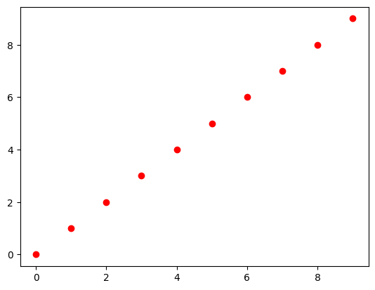
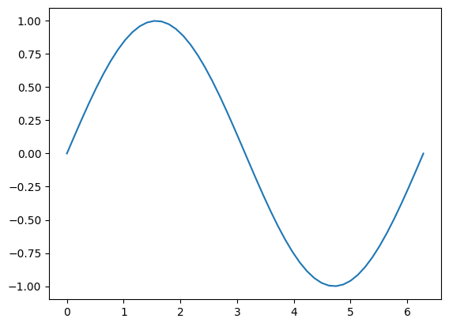
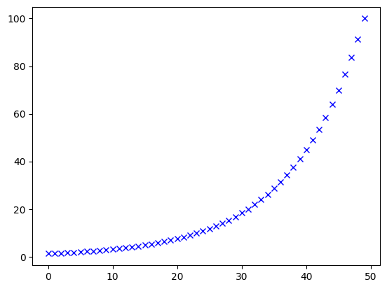

```python
import numpy as np #as np는 numpy를 np로 줄여서 쓰겠다는 선언이다.
numpy.__version__
np.__version__
```


    '1.26.4'


```python
n = 10000000
w = [np.random.random() for _ in range(n)] # _는 이럼없는 변수 
x = [np.random.random() for _ in range(n)] #random.random -> 0~1사이의 난수를 만드는것

wnum = np.array(w) #ndarry type - n차원의 array를 생성한다.
xnum = np.array(x) #다시 시작한다면 같을수도 있지만 거의 다르다. (random이라서)

print(wnum)
print(wnum)
```

    [0.97334413 0.4081146  0.2972106  ... 0.51812423 0.54434033 0.30366948]
    [0.97334413 0.4081146  0.2972106  ... 0.51812423 0.54434033 0.30366948]
    


```python
%%time 
total = 0
for i in range(n):
    total += w[i]*x[i] # dot product : 같은 위치의 w1과 x1끼리 곱한걸 더해주는 코드
print(total)
```

    2500767.922521863
    CPU times: total: 812 ms
    Wall time: 1.46 s
    


```python
%%time
total = np.dot(wnum,xnum)
print(total)
```

    2500767.9225221756
    CPU times: total: 15.6 ms
    Wall time: 11.8 ms
    

### numPy배열의 속성
ndarray - 넘파이 클래스 이름
   ndarray 속성
   - ndim - 차원, axis(축) 개수, rank
   - Shape - 형상, 각 차원의 배열의 크기 (n,m행렬)
   - Strides (dim 간의 간격, 원소간 간격) -> 행당 byte수, 칸당 byte수
   - Size - 배열의 모든 원소의 개수
   - dtype - 원소의 자료 형식 (float64, int32 ...)


```python
def pprint(arr):
    print("type:{}, size:{}".format(type(arr), arr.size)) 
    #format의 내용이 {}안으로 들어간다.
    print("shape:{}, ndim/rank:{}, dtype:{}".format(arr.shape, arr.ndim, arr.dtype))
    print("Array's Data:")
    print(arr)
```


```python
a = np.array([1,2,3,4])
a = np.array((1,2,3,4))
#a = np.array(1,2,3,4) #error
```


```python
a = np.arange(12) # 0에서부터 12개
pprint(a)
```

    type:<class 'numpy.ndarray'>, size:12
    shape:(12,), ndim/rank:1, dtype:int32
    Array's Data:
    [ 0  1  2  3  4  5  6  7  8  9 10 11]
    

### 배열 생성 함수
- zeros - 모든 원소 0
- ones - 모든 원소 1
- full - 사용자가 지정한 값
- empty - 임의의 값
- eye - 단위 행렬

### 데이터 생성 함수
- arrange([start,], stop[,step], dtype=None)
  start에서 stop미만까지, step간격으로 데이터 생성


```python
import matplotlib.pyplot as plt #python에서 그래프 그려주는 라이브러리
%matplotlib inline

a = np.arange(10)
plt.plot(a,'or')
plt.show() #그려달라고 해야지 그려줌
```


    

    


```python
x = np.linspace(0, 2*np.pi)
y = np.sin(x)
plt.plot(x,y)
plt.show()
```


    

    


```python
a = np.logspace(0.1, 2)
plt.plot(a,'xb')
plt.show()
```


    

    


### 인덱싱
- 0부터 시작
- -1 배열의 끝
- : 범위 지정
   0  1  2  3   
0  1  2  3  4  -3   
1  5  6  7  8  -2   
2  9  10 11 12 -1   
  -4  -3 -2 -1    


### Setting Array Elements


```python
a = np.arange(1,13).reshape(3,4)
a
```


    array([[ 1,  2,  3,  4],
           [ 5,  6,  7,  8],
           [ 9, 10, 11, 12]])


```python
a[1,2]
```


    7


```python
a[2,3]
```


    12


```python
a[-1,-1]
```


    12


```python
a[-1]
```


    array([ 9, 10, 11, 12])


```python
a[:,0]
```


    array([1, 5, 9])


```python
a[:,-1]
```


    array([ 4,  8, 12])


```python
a[:2,:2]
```


    array([[1, 2],
           [5, 6]])


```python
a[-2:,-2:]
```


    array([[ 7,  8],
           [11, 12]])


```python
a[:,:2]
```


    array([[ 1,  2],
           [ 5,  6],
           [ 9, 10]])


```python
a[:,:]
```


    array([[ 1,  2,  3,  4],
           [ 5,  6,  7,  8],
           [ 9, 10, 11, 12]])


### Setting Array Elements


```python
a[0]
```


    0


```python
a[0] = 10
a
```


    array([10,  1,  2,  3,  4,  5,  6,  7,  8,  9])


```python
a.dtype
```


    dtype('int32')


```python
a[0] = 10.6 #type이 int이기 때문에 자동으로 버림을 진행한다.
a
```


    array([10, -4, -4, -4, -4, -4, -4, -4, -4, -4])


```python
a.fill(-4.8)
a
```


    array([-4, -4, -4, -4, -4, -4, -4, -4, -4, -4])


### Multi-Dimensional Arrays


```python
a = np.array([[0,1,2,3],[10,11,12,13]])
a
```


    array([[ 0,  1,  2,  3],
           [10, 11, 12, 13]])


```python
a.shape # 행렬의 수
```


    (2, 4)


```python
a.size # 총 크기
```


    8


```python
a.ndim # 차원
```


    2


```python
a[1,3]
```


    13


```python
a[1, 3] =-1
a
```


    array([[ 0,  1,  2,  3],
           [10, 11, 12, -1]])


```python
a[1] # 첫번째 행만 의미한다.
```


    array([10, 11, 12, -1])


### Array Slicing : A행렬을 다른거 만들어야 함


```python
a[0, 3:5]
```


    array([3])


```python
a[4:, 4:]
```


    array([], shape=(0, 0), dtype=int32)


```python
a[:,2]
```


    array([ 2, 12])


```python
a[2::2, ::2] # 2::2 = 2부터 끝까지 step을 2로(2간격으로), ::2 = 전체를 2간격으로 
```


    array([], shape=(0, 2), dtype=int32)


### Assigning to a Slice

```
def f(ll,a){
    # 포인트로 들어오는 이유가 l과 ll이 같은 리스트를 가르킨다.
    ll[0] = 100
    return
}

l = [1,2]
f(f,3) # 리스트가 포인트(주소)로 넘어간다.
l = ? # 따라서 [100,2]가 출력된다. -> 이런걸 side effect라고 한다.
```


```python
a = np.array([0,1,2,3,4])
a[-2:]
```


    array([3, 4])


```python
a[-2:] = [-1, -2] # slice는 복사가 아니라 포인트를 가져오는것이다.
a
```


    array([ 0,  1,  2, -1, -2])


```python
a[-2:] = 99
a
```


    array([ 0,  1,  2, 99, 99])


### 실습


```python
a = np.arange(25).reshape(5,5)
red = a[:,1::2]
red
```


    array([[ 1,  3],
           [ 6,  8],
           [11, 13],
           [16, 18],
           [21, 23]])


```python
blue = a[1::2,0:3:2]
blue
```


    array([[ 5,  7],
           [15, 17]])


```python
yellow = a[-1,:]
yellow
```


    array([20, 21, 22, 23, 24])


### Slice Arrays Share Data


```python
a = np.array([0,1,2,3,4])
b = a[2:4]
b
```


    array([2, 3])


```python
b[0] = 10
b #변수로 저장해도 포인트를 저장하기 때문에 원본이 바뀌게 된다.
```


    array([10,  3])


```python
a
```


    array([ 0,  1, 10,  3,  4])


```python
np.shares_memory(a,b) # 이거 뭐노
```


    True


```python
a = np.arange(1,13).reshape(3,4)
b= a[:2,:2]
b
```


    array([[1, 2],
           [5, 6]])


```python
b[0,0] = 99
a
```


    array([[99,  2,  3,  4],
           [ 5,  6,  7,  8],
           [ 9, 10, 11, 12]])


```python
a = np.arange(1,13).reshape(3,4)
aa = a
aa[0,0] = 99
a
```


    array([[99,  2,  3,  4],
           [ 5,  6,  7,  8],
           [ 9, 10, 11, 12]])


```python
# 내용만 복사하고 싶다면
a = np.arange(1,13).reshape(3,4)
aa = a.copy()
aa[0,0] = 99
a
```


    array([[ 1,  2,  3,  4],
           [ 5,  6,  7,  8],
           [ 9, 10, 11, 12]])


### Fancy Indexing


```python
a = np.arange(0,80,10)
```


```python
indices = [1, 2, -3]
y = a[indices]
y # 포인트를 공유하지 않는다.
```


    array([10, 20, 50])


```python
a[indices] = 99
a
```


    array([ 0, 99, 99, 30, 40, 99, 60, 70])


```python
mask = np.array([0,1,1,0,0,1,0,0],dtype=bool) 
# 이거 잘 모르겠당...
y = a[mask]
y
```


    array([99, 99, 99])


```python
a = np.arange(36).reshape(6,6)
a[1] = np.arange(10, 16)
a[2] = np.arange(20, 26)
a[3] = np.arange(30, 36)
a[4] = np.arange(40, 46)
a[5] = np.arange(50, 56)
a
```


    array([[ 0,  1,  2,  3,  4,  5],
           [10, 11, 12, 13, 14, 15],
           [20, 21, 22, 23, 24, 25],
           [30, 31, 32, 33, 34, 35],
           [40, 41, 42, 43, 44, 45],
           [50, 51, 52, 53, 54, 55]])


```python
b = np.vstack([np.arange(i, i+6) for i in range(0, 51, 10)])
b
```


    array([[ 0,  1,  2,  3,  4,  5],
           [10, 11, 12, 13, 14, 15],
           [20, 21, 22, 23, 24, 25],
           [30, 31, 32, 33, 34, 35],
           [40, 41, 42, 43, 44, 45],
           [50, 51, 52, 53, 54, 55]])


```python
a[[0,1,2,3,4],[1,2,3,4,5]]
```


    array([ 1, 12, 23, 34, 45])


```python
a[3: ,[0,2,5]]
```


    array([[30, 32, 35],
           [40, 42, 45],
           [50, 52, 55]])


```python
mask = np.array([1,0,1,0,0,1],dtype=bool)
a[mask, 2]
```


    array([ 2, 22, 52])


```python
a = np.random.random(7) # 0~1까지중 랜덤으로 7번
results = a > 0.6
print(results)
```

    [False  True False False  True  True False]
    


```python
print(np.sum(results))
print(np.argwhere(results))
```

    3
    [[1]
     [4]
     [5]]
    


```python
x = np.arange(6).reshape(2,3)
x
```


    array([[0, 1, 2],
           [3, 4, 5]])


```python
np.argwhere(x>1)
```


    array([[0, 2],
           [1, 0],
           [1, 1],
           [1, 2]], dtype=int64)


### 실습


```python
a = np.arange(25).reshape(5,5)
blue = a[[0,1,2,3],[3,1,0,4]]
blue
```


    array([ 3,  6, 10, 19])


```python
mask = (a % 3 == 0)
a[mask]
```


    array([ 0,  3,  6,  9, 12, 15, 18, 21, 24])


